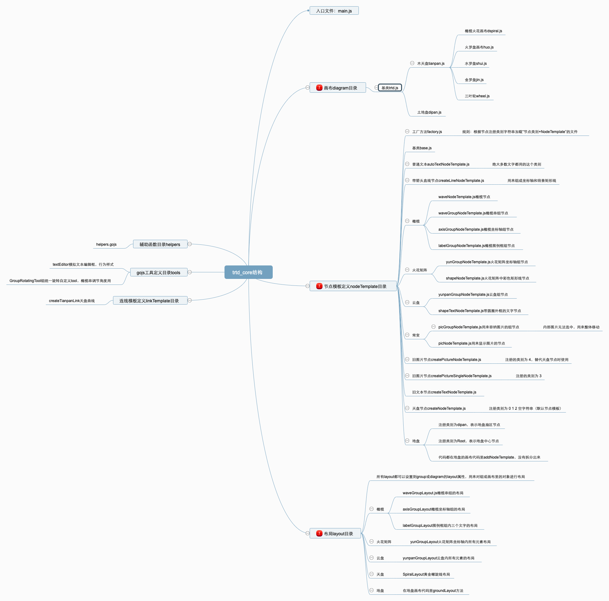

## 简介

hardcore.js(硬核)是一个用于创建各种可视化图形的javascript库，使用canvas，基于商用图形库[gojs](https://gojs.net/latest/index.html)


## 目录

- [简介](#%e7%ae%80%e4%bb%8b)
- [目录](#%e7%9b%ae%e5%bd%95)
- [声明](#%e5%a3%b0%e6%98%8e)
- [特点](#%e7%89%b9%e7%82%b9)
- [在线例子](#%e5%9c%a8%e7%ba%bf%e4%be%8b%e5%ad%90)
- [安装](#%e5%ae%89%e8%a3%85)
- [介绍](#%e4%bb%8b%e7%bb%8d)
- [起步](#%e8%b5%b7%e6%ad%a5)
- [常用命令](#%e5%b8%b8%e7%94%a8%e5%91%bd%e4%bb%a4)
- [Api文档](#api%e6%96%87%e6%a1%a3)
    - [初始化new Trtd("domId", options)](#%e5%88%9d%e5%a7%8b%e5%8c%96new-trtd%22domid%22-options)
    - [addCbian(options) - 添加常变](#addcbianoptions---%e6%b7%bb%e5%8a%a0%e5%b8%b8%e5%8f%98)
    - [addAxisGroup(options) - 插入拓扑](#addaxisgroupoptions---%e6%8f%92%e5%85%a5%e6%8b%93%e6%89%91)
    - [resetZoom(value) - 控制画布缩放比例，参考scale](#resetzoomvalue---%e6%8e%a7%e5%88%b6%e7%94%bb%e5%b8%83%e7%bc%a9%e6%94%be%e6%af%94%e4%be%8b%e5%8f%82%e8%80%83scale)
    - [apiGetTheme() - 获取画布的主题，获取第一个满足以下条件节点的text值：role == "theme" 或者 role == "themeText" 或者 subRole == "themeText"](#apigettheme---%e8%8e%b7%e5%8f%96%e7%94%bb%e5%b8%83%e7%9a%84%e4%b8%bb%e9%a2%98%e8%8e%b7%e5%8f%96%e7%ac%ac%e4%b8%80%e4%b8%aa%e6%bb%a1%e8%b6%b3%e4%bb%a5%e4%b8%8b%e6%9d%a1%e4%bb%b6%e8%8a%82%e7%82%b9%e7%9a%84text%e5%80%bcrole--%22theme%22-%e6%88%96%e8%80%85-role--%22themetext%22-%e6%88%96%e8%80%85-subrole--%22themetext%22)
    - [](#)
- [扩展阅读](#%e6%89%a9%e5%b1%95%e9%98%85%e8%af%bb)
- [调试与提交bug](#%e8%b0%83%e8%af%95%e4%b8%8e%e6%8f%90%e4%ba%a4bug)
- [如何参与项目](#%e5%a6%82%e4%bd%95%e5%8f%82%e4%b8%8e%e9%a1%b9%e7%9b%ae)
- [Todo](#todo)
- [License](#license)

## 声明
hardcore.js是基于gojs开发的一个图形库，仅用于公益目的，本项目中不包括gojs库。任何使用者，如果将本项目用于商业目的，都需要去[gojs](https://gojs.net/latest/index.html)获取商业授权。由于不当使用该项目引起的任何纠纷本项目概不负责。

## 特点
* 可以很方便地绘制拓扑图，火花矩阵图，常变图等多种图形
* 数据驱动图形，开发者可以通过修改json数据来方便地增删图形以及改变图形样式
* 对外提供来各种接口，开发者可以自定义各种交互操作触发的行为
* 基于功能强大的绘图库[gojs](https://gojs.net/latest/index.html)

## 在线例子
* [橄榄拓扑](https://dayong-ymyai.github.io/hardcore/demos/demo-main.dspiral.html)
* [火花矩阵八维](https://dayong-ymyai.github.io/hardcore/demos/demo-main.yun.html)
* [云盘](https://dayong-ymyai.github.io/hardcore/demos/demo-main.yunpan.html)
* [天盘](https://dayong-ymyai.github.io/hardcore/demos/demo-main.tianpan.html)
* [地盘](https://dayong-ymyai.github.io/hardcore/demos/demo-main.dipan.html)
* [火盘](https://dayong-ymyai.github.io/hardcore/demos/demo-main.huo.html)
* [水盘](https://dayong-ymyai.github.io/hardcore/demos/demo-main.shui.html)
* [金盘](https://dayong-ymyai.github.io/hardcore/demos/demo-main.jin.html)
* [三叶轮](https://dayong-ymyai.github.io/hardcore/demos/demo-main.wheel.html)
* [常变](https://dayong-ymyai.github.io/hardcore/demos/demo-main.cbian.html)

## 安装

可以通过引入js文件
```html
<script src='https://cdnjs.cloudflare.com/ajax/libs/gojs/1.8.16/go.js'></script>
<script src='https://cdnjs.cloudflare.com/ajax/libs/hardcore/0.0.1/hardcore.js'></script>
```

以下引入方式待补充

This is a JavaScript module available through the
[npm registry](https://www.npmjs.com/).

Before installing, [download and install Node.js](https://nodejs.org/en/download/).
Node.js 8.0 or higher is required.
该项目运行时需要用到gojs，安装时需要线引入gojs
Installation is done using the
[`npm install` command](https://docs.npmjs.com/getting-started/installing-npm-packages-locally):

```sh
$ npm install gojs@1.8.16
$ npm install hardcord
```


## 介绍

hardcore.js是一个JavaScript图形库，底层是基于canvas，使用gojs作为底层绘图引擎，该项目开源协议为Apache-2.0。

代码结构图：
[查看大图](docs/images/trtd_core.png)


下面是一个简单的例子:

在html文件里引入gojs和hardcord.js
```html
<!-- 通过cdn引入gojs -->
<script src='https://cdnjs.cloudflare.com/ajax/libs/gojs/1.8.16/go.js'></script>
<!-- gojs里用到的图形定义js文件 -->
<script src='./figure.js'></script>
<!-- 本地编译的库文件 -->
<script src='../lib/main.js'></script> 
```
在script标签中添加如下代码

```js
// 定义gojs画布对象
var myDiagram;
    function load() {

        if (myDiagram) {
            myDiagram.diagram == null;
        }
        // 初始化canvas图形对应的json数据，这里用的是默认的拓扑数据
        var jsonData = {
            "class": "go.GraphLinksModel",
            // type用来定义当前图形类型，火花矩阵和拓扑用的都是“dspriral”
            "modelData": { "currentType": "tianpan", "type": "dspiral", "updatedAt": 1565074310990 },
            // nodeDataArray里记录图形里面所有的节点元素，数组。
            "nodeDataArray": [
              // category用来定义当前节点元素的类别，labelGroup表示的是橄榄左上角图例框组的节点。
              // isGroup=true表示该节点是gojs里的group，可以包含其他节点元素（node）。
              // loc：表示当前节点在画布里的位置，通过go.Point.stringify(point)来获得
              // key：节点元素在画布的唯一标志，不允许重复，如果不指定会自动生产
              // deletable：是否允许删除
              // selectable：是否允许选中
                { "category": "labelGroup", "group": -19, "role": "labelGroup", "isGroup": true, "level": 0, "key": -145, "loc": "-165.9188527901979 -401.3352989284005", "deletable": false, "selectable": false },
                // category=waveGroup，表示橄榄串组的节点，是一个gojs的group类型，包含来诸如实线颜色（shiStroke），虚线颜色（xuStroke），中线颜色（centerStroke），橄榄长度（oliveWidth），橄榄厚度（oliveHeight），是否包含开放尾部（haveTail），橄榄类型（oliveType：Wave螺旋形状，olive为橄榄形状），允许的最大橄榄数量（maxOlive），文字方向（textAngle：horizontal表示水平，vertical表示文字平行中轴）
                { "category": "waveGroup", "deletable": false, "haveTail": false, "oliveType": "Wave", "shiStroke": "rgba(14, 57, 157, 1)", "xuStroke": "rgba(203, 28, 39, 1)", "oliveWidth": 150, "oliveHeight": 120, "isGroup": true, "level": 0, "key": -15, "loc": "-267.41885279019795 -104.90629298215362", "angle": 330.08938180947, "group": -19, "movable": false, "desiredSize": "700 120", "textAngle": "horizontal", "centerTextAngle": "independent", "centerTextMode": "independent", "centerStroke": "rgba(9, 166, 9, 1)", "maxOlive": 50 },
                // category=axisGroup，表示拓扑图形最外层的group
                { "category": "axisGroup", "isGroup": true, "level": 0, "key": -19, "loc": "-267.41885279019795 -104.90629298215367", "angle": 0, "desiredSize": "300 150", "textStroke": "black", "textAlign": "center" },
                // catgory=line表示直线类型的节点，width：直线的长度，height：直线宽度，group=-15表示该直线属于key=-15的group节点，angle表示该直线旋转的角度（水平右方向为0度），role=centerLine表示该直线为拓扑里中轴线（中轴线的angle控制整个橄榄串的角度，中轴线上的所有橄榄会自动对齐角度），stroke控制直线的颜色（css一样的颜色定义方式），desiredSize控制节点元素的实际大小（优先级高于width和height）
                { "category": "line", "level": 0, "key": -11, "loc": "-267.41885279019783 -104.90629298215379", "desiredSize": "700 1", "width": 1400, "height": 1, "group": -15, "angle": 330.08938180947, "role": "centerLine", "selectable": false, "stroke": "rgba(9, 166, 9, 1)" },
                // 直线类型节点，role=axisX表示该直线为坐标轴X轴（横轴）
                { "category": "line", "level": 0, "key": -8, "loc": "-267.4188527901981 -104.90629298215362", "desiredSize": "606.7630471788291 10", "width": 1400, "height": 1, "angle": 0, "group": -19, "role": "axisX", "selectable": false, "stroke": "#0e399d" },
                // 直线类型节点，role=axisY表示该直线为坐标轴Y轴（纵轴）
                { "category": "line", "level": 0, "key": -7, "loc": "-267.4188527901979 -104.90629298215384", "desiredSize": "349.05387059630493 10", "width": 1400, "height": 1, "angle": 270, "group": -19, "role": "axisY", "selectable": false, "stroke": "#cb1c27" },
                // category=autoText表示该节点为通用文字节点元素，role=axisYText表示该文字为Y轴顶部文字（随纵轴长度变化自动调整位置），locationSpot表示文字相对坐标中心的位置（参考[gojs文档](https://gojs.net/latest/api/symbols/Spot.html)），text存储该节点对应的文字内容，font控制该文字字体样式（同CSS文字样式）
                { "text": "能量", "deletable": false, "font": "24px 'Microsoft YaHei'", "category": "autoText", "loc": "-277.4188527901979 -453.9601635784589", "key": -12, "role": "axisYText", "locationSpot": "1 0.5 0 0", "group": -19, "movable": true },
                // role=themeText表示该节点为该拓扑的主题（不允许删除，可以通过myDiagram.__trtd.apiGetTheme()获取该节点对应text），movable控制该节点是否允许拖动，width控制该文字最大宽度（超过该宽度会自动换行）
                { "text": "主题", "role": "themeText", "deletable": false, "font": "24px 'Microsoft YaHei'", "category": "autoText", "loc": "-310.9294316472132 -101.40896142630251", "key": -13, "level": 0, "group": -19, "locationSpot": "0.5 0 0 0", "movable": true, "width": 300 },
                // role=axisXText表示该文字为X轴顶部文字（随横轴长度变化自动调整位置）
                { "text": "时间", "deletable": false, "font": "24px 'Microsoft YaHei'", "category": "autoText", "loc": "339.3441943886312 -104.90629298215362", "key": -14, "role": "axisXText", "group": -19, "locationSpot": "0.5 0 0 0" },
                // role=labelText1表示该文字为图例框中第一个文字，iconVisible控制文字节点是否显示左侧的图标，textAlign控制文字对齐方式（start，end，center），visible控制节点是否显示，minSize控制文字节点最小宽高
                { "text": "实线：", "deletable": false, "fill": "rgba(14, 57, 157, 1)", "iconVisible": true, "locationSpot": "0 0 0 0", "textAlign": "start", "category": "autoText", "loc": "-239.41885279019792 -462.19828720965", "key": -114, "role": "labelText1", "movable": true, "group": -145, "visible": true, "minSize": "120 30" },
                // role=labelText1表示该文字为图例框中第二个文字
                { "text": "虚线：", "deletable": false, "fill": "rgba(203, 28, 39, 1)", "iconVisible": true, "locationSpot": "0 0 0 0", "textAlign": "start", "category": "autoText", "loc": "-239.41885279019792 -421.3352989284021", "key": -116, "role": "labelText2", "movable": true, "group": -145, "visible": true, "minSize": "120 30" },
                // role=labelText1表示该文字为图例框中第三个文字
                { "text": "中线：", "deletable": false, "fill": "rgba(9, 166, 9, 1)", "iconVisible": true, "locationSpot": "0 0 0 0", "textAlign": "start", "category": "autoText", "loc": "-239.41885279019792 -380.4723106471507", "key": -117, "role": "labelText3", "movable": true, "group": -145, "visible": true, "minSize": "120 30" },
                // category=wave表示该节点是橄榄节点，order表示该橄榄在橄榄串中的位置（从1开始，橄榄串会根据order值从小到大排布顺序），shiText指向该橄榄对应的实线文字的key，xuText指向该橄榄对应的虚线文字的key，angle为该橄榄的角度一般跟随role=centerLine的中线，centerText指向该橄榄对应的隐藏中线上文字节点的key（为了实线中线文字横向而添加独立的文字节点），shiStroke控制该橄榄实线部分颜色，xuStroke控制该橄榄虚线部分颜色，textVisible控制该橄榄本身的文字是否显示（当橄榄串文字方向为horizontal时，显示独立的centerText，隐藏橄榄本身文字）
                { "category": "wave", "text": "1\n", "level": 0, "key": "0807d53b-8c86-5a76-1a22-e782324e0521", "group": -15, "desiredSize": "150 120", "order": 1, "shiText": "72c7866c-5fb7-2406-a01d-e5e30cff982f", "xuText": "fb893883-db72-2a9d-0aa4-ef3b2382aabe", "angle": 330.08938180947, "loc": "-267.41885279019795 -104.90629298215376", "oliveType": "Wave", "textAlign": "center", "shiStroke": "rgba(14, 57, 157, 1)", "xuStroke": "rgba(203, 28, 39, 1)", "centerText": "63300656-f2f0-8b1d-7bb7-e6a5b8c832b5", "textVisible": false, "isNew": null },
                // role=shiText表示该文字是实线上文字，order跟对应橄榄一致，olive指向对应的橄榄的key
                { "deletable": false, "text": "", "font": "18px 'Microsoft YaHei'", "category": "autoText", "key": "72c7866c-5fb7-2406-a01d-e5e30cff982f", "width": 150, "role": "shiText", "level": 0, "group": -15, "order": 1, "olive": "0807d53b-8c86-5a76-1a22-e782324e0521", "loc": "-171.37349456638736 -90.36190699786798", "locationSpot": "0 0 0 0", "textStroke": "rgba(14, 57, 157, 1)", "showBorder": true, "angle": 0, "minSize": "120 30", "textAlign": "center" },
                // role=xuText表示该文字是虚线上的文字，olive指向橄榄的key
                { "deletable": false, "text": "", "font": "18px 'Microsoft YaHei'", "category": "autoText", "key": "fb893883-db72-2a9d-0aa4-ef3b2382aabe", "width": 150, "role": "xuText", "level": 0, "group": -15, "order": 1, "olive": "0807d53b-8c86-5a76-1a22-e782324e0521", "loc": "-231.70994934089146 -195.2452337244941", "locationSpot": "1 1 0 0", "textStroke": "rgba(203, 28, 39, 1)", "showBorder": true, "angle": 0, "minSize": "120 30", "textAlign": "center" },
              // ......
              // 省略一部分重复代码
              // ......
                // role=centerText表示该节点是橄榄中线对应的文字（在category=waveGroup节点的textAngle=horizontal时显示，textAngle=vertical时隐藏，通过visible属性控制显示隐藏），layerName表示该节点所处的层级（foreground，background）
                { "text": "1\n", "minSize": "120 30", "deletable": false, "textAlign": "center", "font": "18px 'Microsoft YaHei'", "category": "autoText", "key": "63300656-f2f0-8b1d-7bb7-e6a5b8c832b5", "width": 120, "role": "centerText", "level": 0, "group": -15, "order": 1, "visible": true, "layerName": "Foreground", "locationSpot": "0.5 0.5 0 0", "selectable": false, "olive": "0807d53b-8c86-5a76-1a22-e782324e0521", "loc": "-201.54172195363935 -142.80357036118116", "angle": 0 },
                // 省略一部分代码
            ],
            "linkDataArray": []
        }
        /**
        引入hardcord.js后，会自动在全局挂载Trtd对象，可以通过Trtd对象创建画布实例
         new Trtd("dom元素的ID", {
          type: 图形的画布类型，注意不是图形类型，目前支持的画布为：dspiral（拓扑火花常变都用的这个画布，目前最为通用），tianpan（天盘的画布），dipan（地盘的画布）
          tpid: 当前数据对应的一个唯一id，库的内部会实时自动将数据存储在localStorage里key=TDCurrent5d492368d9342a0009f3c1f2的值里，其中5d492368d9342a0009f3c1f2就是tpid
          model: 初始化图形的json数据，需要用JSON.stringify序列化之后传入
          // model变化时的回调，传入一个函数，当图形对应的数据变化时触发回调，一般用来自动保存图形
          modelChangedListener: function(model){
            setTimeout(()=>{
              console.log("modelChangedListener,",model)
              this.model = JSON.parse(model.toJson())
              this.saveDataToServer()
            },1000)
          }
          diagramConfig:传入gojs的diagram原始的配置参数，参考gojs官方文档，https://gojs.net/latest/api/symbols/Diagram.html
          // 常用gojs原始配置举例说明
          diagramConfig:{
              // 以下事件可以参考gojs的diagram事件文档https://gojs.net/latest/api/symbols/DiagramEvent.html，也可以查看更多事件
              // 当前选中的节点对象发生变化后触发
              ChangedSelection: function(e){
               // e 为gojs的inputEvent对象，参考gojs文档：https://gojs.net/latest/api/symbols/InputEvent.html
              if(e.diagram.selection.count == 0){
                // do something...
                that.styleShow = false;
              }else{
                 // do something...
              }
            },
            // 对象单击后触发该事件
            ObjectSingleClicked:function(e){
              let myDiagram = e.diagram;
              // 获取当前选中的元素中第一个元素
              let node = myDiagram.selection.first();
              // 判断当前是否选中节点
              if(!node) {
                return;
              }
              // 可以根据节点的category或其他属性来做进一步处理
              // e.diagram.selection.first().data.category
            },
            // 节点对象双击时触发
            ObjectDoubleClicked:function(e){
              // console.info(e.diagram.selection.first().data.category)
            }
        })
        // 节点双击时的回调
        nodeDoubleClickListener:(node)=>{
          this.nodeDoubleClickListener(node)
        },
        // 删除节点前的回调，可以用来做删除二次确认
         deleteCallback: async function(data){
              if(!data || !data.hasOwnProperty('figureId')){
                return;
              }
              let _doDeleteFigure = await that.$http.post('/deleteFigure',{"figureId":data.figureId});
              if(_doDeleteFigure.data.code !=0){
                console.warn(`ERROR: @post /deleteFigure failed! ${_doDeleteFigure.data.message}`);
              }else{
                console.log(_doDeleteFigure);
              }
          },
        })
        **/
        myDiagram = new Trtd("myDiagramDiv", {
            modelChangedListener: function (m) {
                // console.log('from trtd:',m);
            },
            model: JSON.stringify(jsonData)
        })

    }
    load();
```

上面的完整代码请查看[demos/demo-main.dspiral.html](demos/demo-main.dspiral.html)


## 起步

1. 开发
  * git clone下来代码后 `npm install` 安装所有依赖模块
  * 然后执行 `npm run dev`. 将会在lib目录下生成main.js，同时会自动监听代码变更实时更新main.js。
  * 打开demos下面[demos/demo-main.dspiral.html](demos/demo-main.dspiral.html)可以查看当前更改代码的结果，更改代码需要刷新页面才能生效。
2. 打包
  * `npm install` 安装依赖
  * `npm run build` 会在lib下生成hardcore.min.js
  * 可以将生成的lib目录下的文件放到其他项目代码里引入
3. 测试
  * Run `yarn test` or `npm run test`

## 常用命令

* `npm run build` - produces production version of your library under the `lib` folder
* `npm run dev` - produces development version of your library and runs a watcher
* `npm run test` - well ... it runs the tests :)
* `npm run publish` - 发布到线上cdn，需要配置文件

## Api文档
#### 初始化new Trtd("domId", options)
初始化通过myDiagram = new Trtd()初始化myDiagram后，可以通过myDiagram.__trtd访问hardcore提供的api，来操作图形
domId: 将在该dom元素下创建canvas
options:
* modelChangedListener(model) - model变化时的回调，传入一个函数，当图形对应的数据变化时触发回调，一般用来自动保存图形
* nodeDoubleClickListener(node) - 节点双击时的回调
* nodeClickListener(node) - 节点单击时的回调
* showContextMenuListener
* hideContextMenuListener
* cxElement - 外部传入的菜单dom元素
* deleteCallback(data) - 删除节点前的回调，可以用来做删除二次确认
* type - 画布（diagram）类型，dspiral:橄榄火花常变都用这个画布，后面会持续扩展图形；tianpan:天盘用的画布，兼容早期画布;dipan:地盘专用画布
* containerDivId - 根dom元素上一级dom元素id，调节样式时可能会用到
* model - 初始化图形的json数据，需要用JSON.stringify序列化之后传入
* tpid - 当前数据对应的一个唯一id，库的内部会实时自动将数据存储在localStorage里key=TDCurrent5d492368d9342a0009f3c1f2的值里，其中5d492368d9342a0009f3c1f2就是tpid
* diagramConfig - 传入gojs的diagram原始的配置参数，参考[gojs文档diagram属性](https://gojs.net/latest/api/symbols/Diagram.html)，[gojs文档diagram event事件](https://gojs.net/latest/api/symbols/DiagramEvent.html)
#### addCbian(options) - 添加常变
#### addAxisGroup(options) - 插入拓扑
#### resetZoom(value) - 控制画布缩放比例，参考[scale](https://gojs.net/latest/api/symbols/Diagram.html#scale)
#### apiGetTheme() - 获取画布的主题，获取第一个满足以下条件节点的text值：role == "theme" 或者 role == "themeText" 或者 subRole == "themeText"
#### 

## 扩展阅读

* [Start your own JavaScript library using webpack and ES6](http://krasimirtsonev.com/blog/article/javascript-library-starter-using-webpack-es6)
* [建议阅读gojs官方教程](https://gojs.net/latest/intro/index.html)

## 调试与提交bug
 todo

## 如何参与项目
This project welcomes contributions from the community. Contributions are
accepted using GitHub pull requests. If you're not familiar with making
GitHub pull requests, please refer to the
[GitHub documentation "Creating a pull request"](https://help.github.com/articles/creating-a-pull-request/).

For a good pull request, we ask you provide the following:

1. Try to include a clear description of your pull request in the description.
   It should include the basic "what" and "why"s for the request.
2. The tests should pass as best as you can. 
3. The pull request should include tests for the change. A new feature should
   have tests for the new feature and bug fixes should include a test that fails
   without the corresponding code change and passes after they are applied.
4. If the pull request is a new feature, please be sure to include all
   appropriate documentation additions in the `Readme.md` file as well.
5. To help ensure that your code is similar in style to the existing code,
   run the command `npm run lint` and fix any displayed issues.
   
## Todo
  1. 国际化
  2. 升级gojs版本到2.0以上
  3. 增加火花矩阵的参数说明
  4. 增加常变的参数说明
  5. 数据格式优化
  6. api文档
  7. 定义api的扩展机制
  8. 补充npm的引入方式

## License
 [Apache-2.0](https://www.apache.org/licenses/LICENSE-2.0)